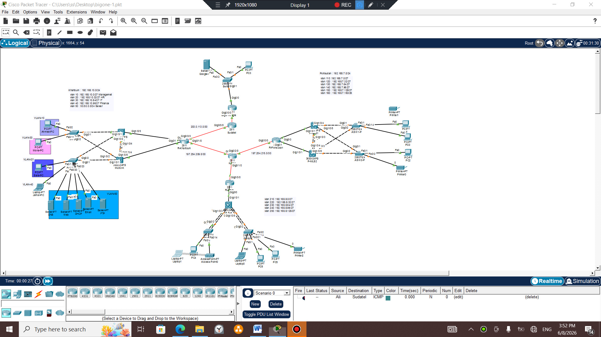
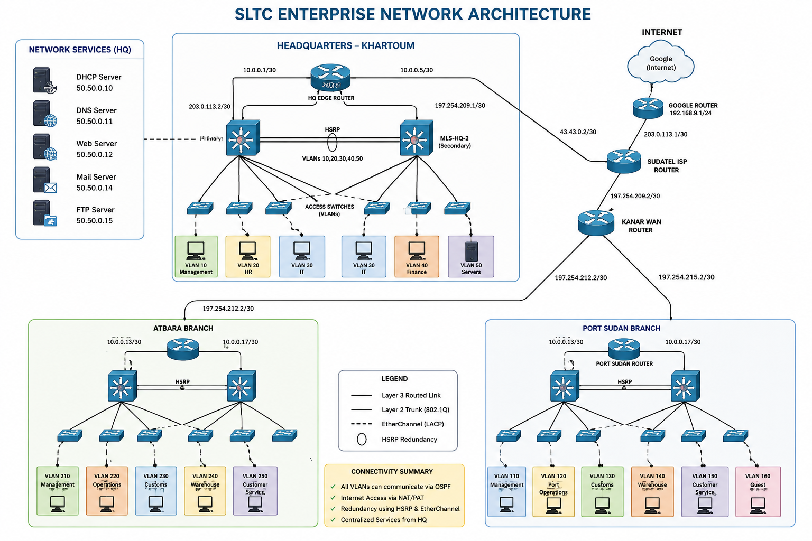
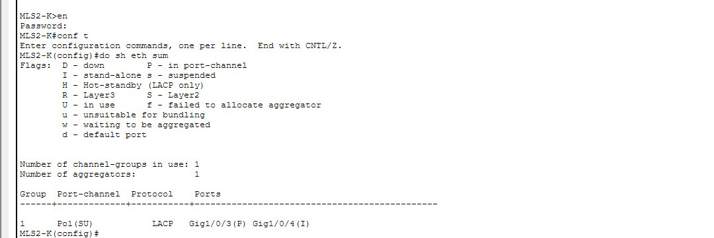
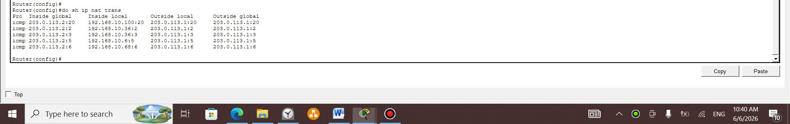
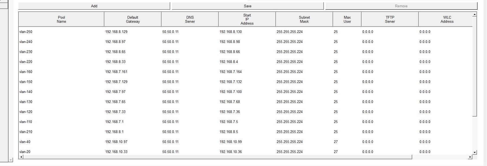
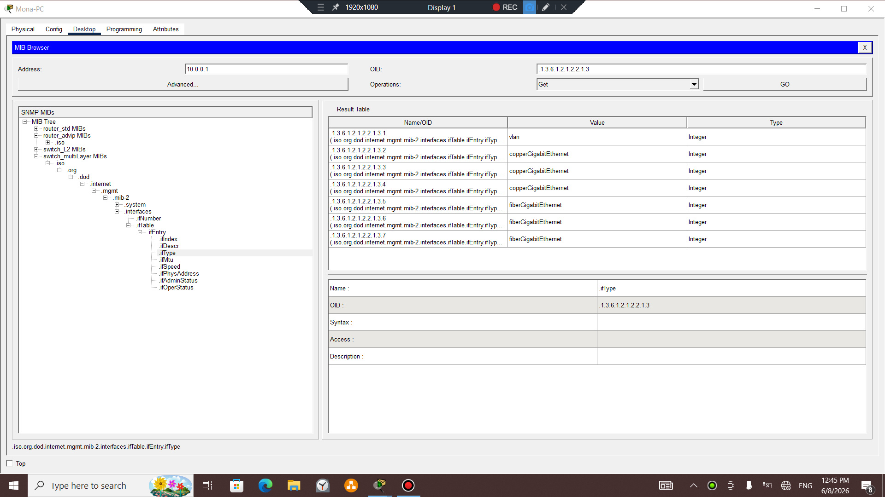
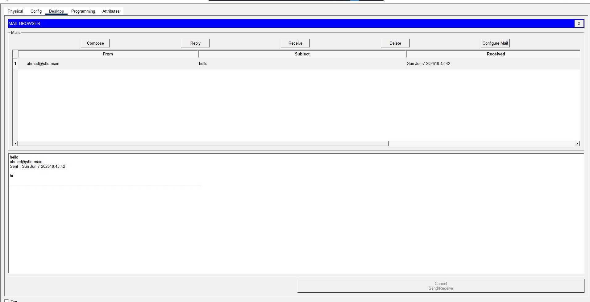

# SLTC Enterprise Network Design

Enterprise Network Design and Implementation for **Sudan Logistics & Trading Company (SLTC)** using Cisco Packet Tracer.

This project simulates a real-world medium-sized enterprise network consisting of a Headquarters and two branch offices connected through a WAN infrastructure. The network was designed following enterprise networking best practices with an emphasis on scalability, security, high availability, and centralized services.

---

## Project Overview

Sudan Logistics & Trading Company (SLTC) is a fictional logistics company operating from its headquarters in **Khartoum** with branch offices in **Port Sudan** and **Atbara**.

The network infrastructure was designed to provide:

- Secure communication between all sites
- Centralized network services
- Dynamic routing
- High availability
- Department segmentation
- Internet connectivity
- Enterprise-level documentation

---

## Network Topology




---

## Network Architecture



## Branches

- Headquarters (Khartoum)
- Port Sudan Branch
- Atbara Branch

---

## Technologies Implemented

| Technology | Status |
|------------|:------:|
| VLAN Segmentation | ✅ |
| Inter-VLAN Routing | ✅ |
| OSPF Dynamic Routing | ✅ |
| HSRP Redundancy | ✅ |
| EtherChannel (LACP) | ✅ |
| ACL Security | ✅ |
| NAT/PAT | ✅ |
| DHCP | ✅ |
| DNS | ✅ |
| Web Server | ✅ |
| FTP Server | ✅ |
| Mail Server | ✅ |
| SSH Management | ✅ |
| SNMP Monitoring | ✅ |

---

## VLAN Design

### Headquarters

| VLAN | Department |
|------|------------|
| 10 | Management |
| 20 | Human Resources |
| 30 | Information Technology |
| 40 | Finance |
| 50 | Servers |

### Port Sudan Branch

| VLAN | Department |
|------|------------|
| 110 | Branch Management |
| 120 | Port Operations |
| 130 | Customs |
| 140 | Warehouse |
| 150 | Customer Service |
| 160 | Guest Network |

### Atbara Branch

| VLAN | Department |
|------|------------|
| 210 | Branch Management |
| 220 | Operations |
| 230 | Warehouse |
| 240 | Customer Service |
| 250 | Guest Network |

---

## Network Services

The enterprise provides centralized services for all branches.

| Service | Description |
|----------|-------------|
| DHCP | Automatic IP Address Allocation |
| DNS | Name Resolution |
| Web Server | Company Website |
| FTP | File Sharing |
| Mail Server | Internal E-mail Communication |

---

## Routing Design

The entire enterprise network uses:

- OSPF Process ID 1
- Area 0
- Dynamic Route Advertisement
- Automatic Route Learning

---

## High Availability

The network implements:

- HSRP
- Redundant Default Gateway
- Automatic Failover

---

## Security Features

- VLAN Segmentation
- Extended ACLs
- NAT/PAT
- SSH Remote Management
- Port Security
- Management VLAN
- Guest Network Isolation

---

## Enterprise Features

- Multi-site Enterprise Design
- Layer 3 Switching
- Dynamic Routing
- WAN Connectivity
- ISP Simulation
- Internet Access
- Centralized Services
- Enterprise Documentation

---

## Validation

The following tests were successfully completed:

- Inter-VLAN Routing
- OSPF Neighbor Formation
- Branch Connectivity
- DHCP Address Assignment
- DNS Resolution
- Web Server Access
- FTP Connectivity
- Mail Communication
- ACL Enforcement
- NAT Translation
- HSRP Failover

## Project Screenshots
### OSPF Neighbor Verification


---

### Routing Table


---

### HSRP Verification



---

### NAT Translation




---

### DHCP & DNS Verification




---

### Company Website


---
### SNMP 


---
### MAIL 


---
### port security 
[Port-Security](Port-security.jpg)

---
## Packet Tracer File

The complete Cisco Packet Tracer project is available in the repository.

📥 **Download the Packet Tracer file:**

- [SLTC_Enterprise_Network.pkt](Packet-traces/STLC.pkt)

> **Note:** This project was developed and tested using Cisco Packet Tracer 9.x. Opening it with an older version may result in compatibility issues.

## Project Structure

```
SLTC-Enterprise-Network/
│
├── Documentation/
├── PacketTracer/
├── Images/
├── Screenshots/
└── README.md
```

---

## Documentation

Detailed documentation includes:

- Enterprise Network Report
- Device Inventory
- Interface Addressing
- VLAN Design
- OSPF Design
- HSRP Design
- NAT Design
- ACL Matrix
- Security Controls
- Verification Results
  
---

## Future Improvements

Possible enhancements include:

- Multi-Area OSPF
- BGP Integration
- IPv6 Deployment
- Wireless Infrastructure
- VPN Connectivity
- QoS Implementation
- Network Automation
- SDN Integration

---

## Tools Used

- Cisco Packet Tracer
- Microsoft Word
- Canva
- GitHub

---

## Author

**Weam Ata**

IT & Network Engineering Student

Sudan University of Science and Technology (SUST)

Interested in Enterprise Networking, Routing & Switching, and Network Security.

---

## License

This project is intended for educational and portfolio purposes.
